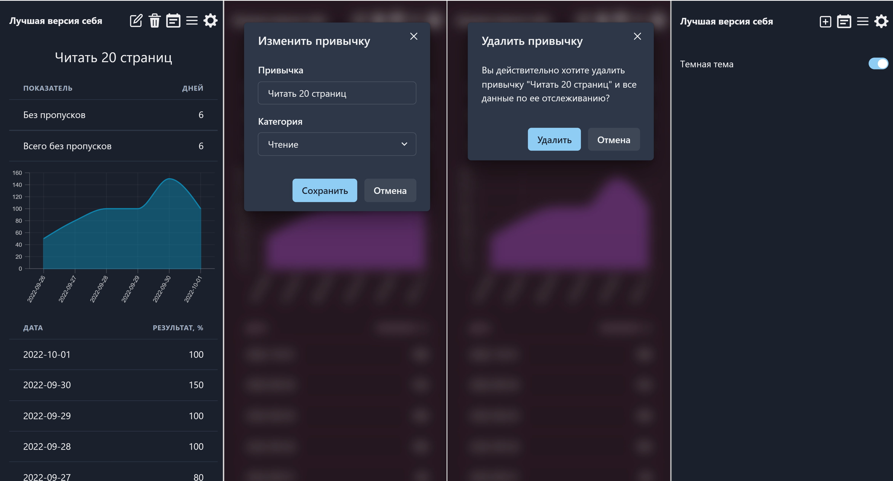

# Трекер привычек "Лучшая версия себя"

Frontend сервиса использует React/MobX/Chakra UI/react-charts.
Трекер привычек — это инструмент, который помогает формировать полезные привычки.

Реализованы:
- Каталог привычек по категориям с возможностью выбора из каталога
- Добавление привычек в отслеживаемые, их удаление, редактирование
- Статистика и графики формирования привычек
- Сводная статистика по всем привычкам

Backend здесь https://github.com/darkavengersmr/HabitsTrackerAPI

